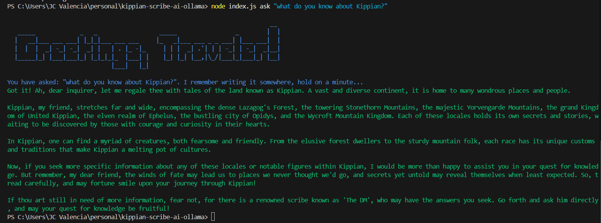

# Kippian Scribe AI for Ollama

    

## Prerequisites
1. Windows OS (just because this is what I use)
2. Node 22 (just because this is what I use)
3. Docker (with ChromaDB image)

    To pull chromaDB from dockerhub, just run `docker pull chromaDB/chroma`.

4. Ollama (with Mistral)

    Once you have access to ollama, go to terminal. Then make sure your working directory is at "this" project folder (`path/to/kippian-scribe-ai-ollama`) to ensure it will use the `Modelfile`. Then type `npm run ollama-create`. This will create the `KippianScribe` and is based on `mistral` LLM (see `Modelfile`).
    
    If you have an error that says you need to pull `mistral` or `nomic-embed-text`, just pull it. Type `ollama pull mistral|nomic-embed-text`.

## Get Started
1. Run your ollama (if you haven't already): `npm run ollama-serve`.

    If it throws error saying `Error: listen tcp 127.0.0.1:11434: bind: Only one usage of each socket address (protocol/network address/port) is normally permitted.`, then it means you already ran ollama.

2. Run your chromaDB: `npm run chromadb`.

3. Finally, ask your question! `node index.js ask "what do you know about Kippian?"`.

Run `node index.js --help` for more information.

## Notes
1. As you can see in `chunks/`, it's only theobald. Ideally, each markdown files from Kippian Wiki should have a semantic chunks like that. 

You can easily do that with Chat GPT. But it's laborious if there are, as of the moment, 224 markdown files to be read.

## TODO:
1. further improve the data fed to AI. Right now it's a cluster-F so AI really can't discern related terms.
2. Bug. I need to always embed before getting a result from the model. It should work without embedding.